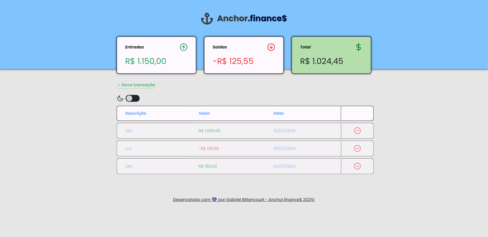
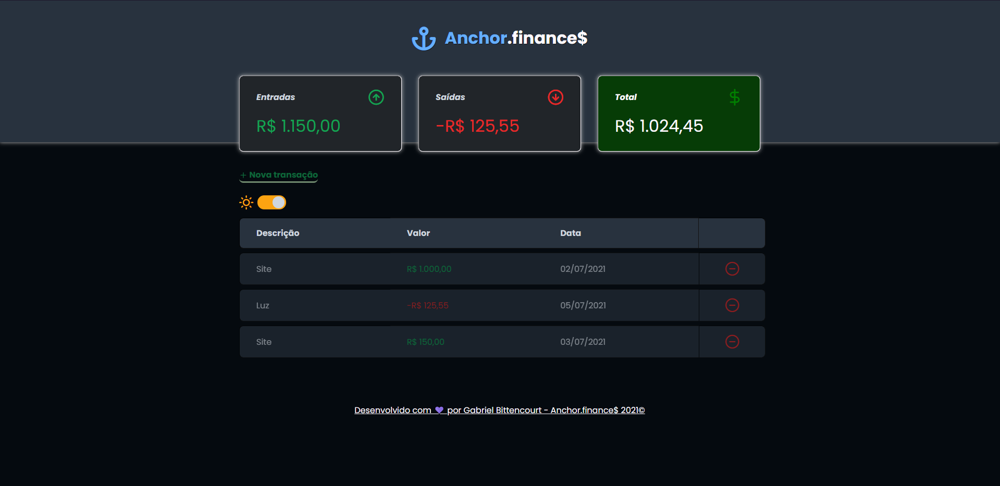
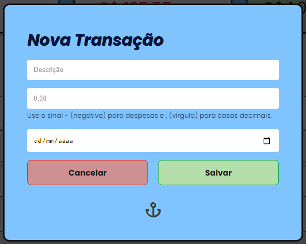
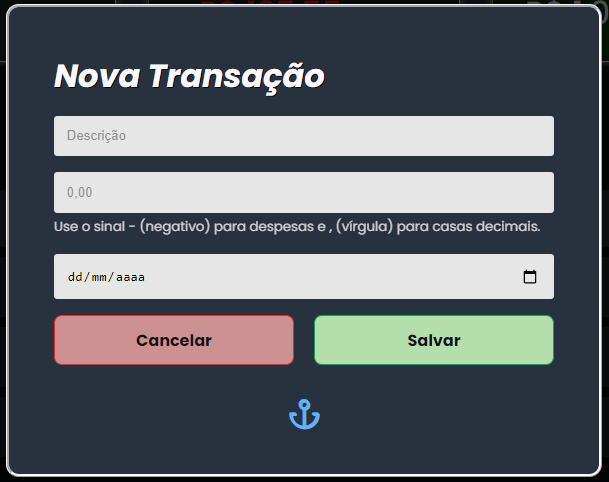

    

<h1 align="center">Anchor.finance$ ⚓</h1>
<h4 align="center">Uma aplicação para o acompanhamento de entradas e saídas em sua conta realizado na maratona Discover.</h4>

---

    <a href="#sobre">Sobre</a> |
    <a href="#imagens">Imagens</a> |
    <a href="#tecnologias">Tecnologias</a> |
    <a href="#licença">Licença</a> |
    <a href="#autor">Autor</a>

## Sobre
**Anchor.finance é uma aplicação para o registro de atividades financeiras(entradas, saídas e total), em sua conta ou para manter organizado em sua rotina, é uma ideia vinda da [Rocketseat](https://github.com/rocketseat-education/maratona-discover-01) e eu tomei a liberdade para implementar mais algumas coisas!**

---

## Imagens

    <b>Light mode da aplicação:</b>
     
    <b>Dark mode da aplicação:</b>
     
    <b>Light mode da modal da aplicação:</b>
     
    <b>Dark mode da modal da aplicação:</b>
     

---